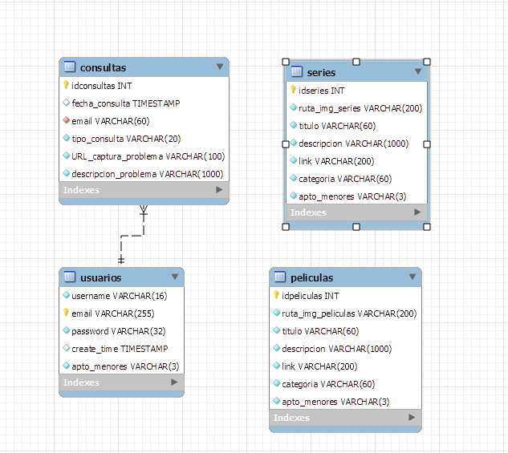
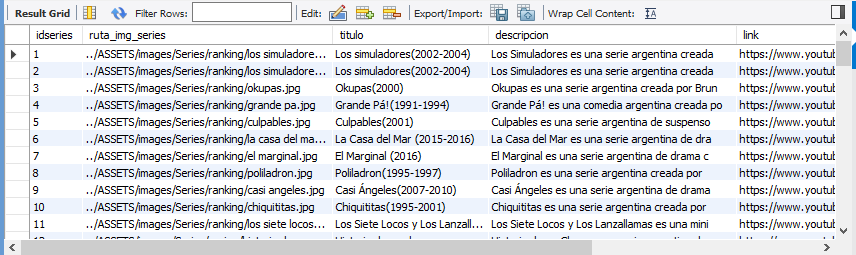

# Creación de la Base de datos en MYSQL para la página de streaming de películas VEOVEO
El esquema de la base de datos es el siguiente:  
  
En MYSQL, las tablas se ven así:  
  
## Configuración de las tablas:  
Las tablas están configuradas de la siguiente manera:  
- Tabla de consultas de los usuarios:  
  
- Tabla de las películas:  
  
- Tabla de las series:  
  
- Tabla de los usuarios registrados:  
  
## Creando registros para llenar las tablas:  
Se transformaron los JSON originales de la página en tablas de excel, para (utilizando las funciones de concatenación de excel) generar los comandos necesarios para completar registros rápidamente.  
Se muestran a continuación las imagenes de las tablas con los registros y en un capítulo posterior se resumen los comandos:  
- Tabla de registros de consultas de los usuarios:  
  
- Tabla de registros de las películas:  
  
- Tabla de registros de las series:  
  
- Tabla de registros de los usuarios registrados:  
  
## Comandos para generar registros en las tablas:  
A continuación, se resumen los comandos para generar cada una de las tablas anteriores:  
```sql
-- Crear esquema de la página web:
CREATE SCHEMA `veoveo` ;

-- Crear tabla de datos de las películas:
CREATE TABLE `veoveo`.`peliculas` (
  `idpeliculas` INT NOT NULL AUTO_INCREMENT,
  `ruta_img_peliculas` VARCHAR(200) NOT NULL,
  `titulo` VARCHAR(60) NOT NULL,
  `descripcion` VARCHAR(1000) NOT NULL,
  `link` VARCHAR(200) NOT NULL,
  `categoria` VARCHAR(60) NOT NULL,
  `apto_menores` VARCHAR(3) NOT NULL,
  PRIMARY KEY (`idpeliculas`));

-- Crear tabla de datos de las series:
CREATE TABLE `veoveo`.`series` (
  `idseries` INT NOT NULL AUTO_INCREMENT,
  `ruta_img_series` VARCHAR(200) NOT NULL,
  `titulo` VARCHAR(60) NOT NULL,
  `descripcion` VARCHAR(1000) NOT NULL,
  `link` VARCHAR(200) NOT NULL,
  `categoria` VARCHAR(60) NOT NULL,
  `apto_menores` VARCHAR(3) NOT NULL,
  PRIMARY KEY (`idseries`));

-- Crear tabla de los usuarios:
CREATE TABLE `veoveo`.`usuarios` (
  `username` VARCHAR(16) NOT NULL UNIQUE,
  `email` VARCHAR(255) NOT NULL,
  `password` VARCHAR(32) NOT NULL,
  `create_time` TIMESTAMP NULL DEFAULT CURRENT_TIMESTAMP(),
  `apto_menores` VARCHAR(3) NOT NULL,
  PRIMARY KEY (`email`));

-- Crear tabla del formulario de contacto
CREATE TABLE `veoveo`.`consultas` (
  `idconsultas` INT NOT NULL AUTO_INCREMENT,
  `fecha_consulta` TIMESTAMP NULL DEFAULT CURRENT_TIMESTAMP(),
  `email` VARCHAR(60) NOT NULL,
  `tipo_consulta` VARCHAR(20) NOT NULL,
  `URL_captura_problema` VARCHAR(100) NOT NULL,
  `descripcion_problema` VARCHAR(1000) NOT NULL,
  PRIMARY KEY (`idconsultas`),
  CONSTRAINT `fk_email_usuario` FOREIGN KEY (`email`)
    REFERENCES `veoveo`.`usuarios` (`email`)
    ON DELETE CASCADE
    ON UPDATE CASCADE
);

-- Crear registros en la tabla de usuarios:
INSERT INTO `veoveo`.`usuarios` (`username`, `email`, `password`, `apto_menores`) VALUES ('gustavo', 'eichhorn.gustavof@gmail.com', '123456','NO');
INSERT INTO `veoveo`.`usuarios` (`username`, `email`, `password`, `apto_menores`) VALUES ('sara', 'abigailsara190@gmail.com', '123456', 'NO');
INSERT INTO `veoveo`.`usuarios` (`username`, `email`, `password`, `apto_menores`) VALUES ('gisela', 'calzadosbranca@gmail.com', '123456','NO');

-- Crear registros en la tabla de películas:
INSERT INTO `veoveo`.`peliculas` (`ruta_img_peliculas`, `titulo`, `descripcion`, `link`, `categoria`, `apto_menores`) VALUES ('../ASSETS/images/Peliculas/Ranking/el_secreto_de_sus_ojos.jpg', 'El secreto de sus ojos', 'El secreto de sus ojos es una aclamada película argentina dirigida por Juan José Campanella. La historia sigue a Benjamín Espósito, un oficial de justicia retirado, que reabre un caso de violación y asesinato de los años 70 para escribir una novela. Mientras busca la verdad, se enfrenta a viejos amores y obsesiones. Con una notable actuación de Ricardo Darín y un guion intrigante, esta obra maestra ganó el Óscar a la Mejor Película Extranjera en 2010.', 'https://www.youtube.com/embed/SOW5EfrTTsE?si=wrdA9mIdkde97cwU', 'diez_mejores', 'SI');
INSERT INTO `veoveo`.`peliculas` (`ruta_img_peliculas`, `titulo`, `descripcion`, `link`, `categoria`, `apto_menores`) VALUES ('../ASSETS/images/Peliculas/Ranking/Un_lugar_en_el_mundo.jpg', 'Un Lugar en el mundo', 'Un lugar en el mundo es una película argentina dirigida por Adolfo Aristarain. La trama sigue a Ernesto, un joven que regresa al pueblo rural donde creció. A través de sus recuerdos, la película explora su infancia y las luchas de su familia y amigos contra las injusticias sociales. Con fuertes actuaciones de Federico Luppi, Cecilia Roth y José Sacristán, este drama emotivo destaca por su profunda humanidad y crítica social. La película recibió numerosos premios y es considerada una obra esencial del cine argentino.', 'https://www.youtube.com/embed/d0eDO3lusC0?si=ruiqVeJBrJ9KNzxJ', 'diez_mejores', 'SI');
INSERT INTO `veoveo`.`peliculas` (`ruta_img_peliculas`, `titulo`, `descripcion`, `link`, `categoria`, `apto_menores`) VALUES ('../ASSETS/images/Peliculas/Ranking/9reinas.jpg', 'Nueve reinas', 'Nueve reinas es una emocionante película argentina dirigida por Fabián Bielinsky. La trama sigue a dos estafadores, Marcos y Juan, que se unen para vender unas valiosas estampillas falsas llamadas Las Nueve Reinas. A medida que avanza el día, se ven envueltos en una serie de engaños y traiciones que mantienen al espectador en vilo. Con destacadas actuaciones de Ricardo Darín y Gastón Pauls, la película es un thriller ingenioso y lleno de giros inesperados. Nueve reinas es considerada un clásico del cine argentino por su brillante guion y dirección.', 'https://www.youtube.com/embed/I42JYVjQkPI?si=5MNCPEHZUCMffPaU', 'diez_mejores', 'SI');
INSERT INTO `veoveo`.`peliculas` (`ruta_img_peliculas`, `titulo`, `descripcion`, `link`, `categoria`, `apto_menores`) VALUES ('../ASSETS/images/Peliculas/Ranking/La_historia_oficial-.jpg', 'La historia oficial', 'La historia oficial es una película argentina dirigida por Luis Puenzo. Ambientada en los años 80, sigue a Alicia, una profesora de historia que comienza a sospechar que su hija adoptiva podría ser hija de desaparecidos durante la dictadura. A medida que investiga, descubre verdades dolorosas que desafían su percepción de la realidad. Con conmovedoras actuaciones de Norma Aleandro y Héctor Alterio, la película ofrece una crítica profunda de la dictadura militar argentina. Ganadora del Óscar a la Mejor Película Extranjera en 1986, La historia oficial es un conmovedor drama sobre la memoria y la justicia.', 'https://www.youtube.com/embed/BibM13-Jd8E?si=7FR9ie_V6RIKmkKd', 'diez_mejores', 'SI');
INSERT INTO `veoveo`.`peliculas` (`ruta_img_peliculas`, `titulo`, `descripcion`, `link`, `categoria`, `apto_menores`) VALUES ('../ASSETS/images/Peliculas/Ranking/El_hijo_de_la_novia.jpg', 'El hijo de la novia', 'El hijo de la novia es una conmovedora película argentina dirigida por Juan José Campanella. La historia sigue a Rafael, un hombre de mediana edad abrumado por la vida, que busca redimirse al ayudar a su madre, quien padece Alzheimer, a cumplir su sueño de casarse por la iglesia. Con emotivas actuaciones de Ricardo Darín, Héctor Alterio y Norma Aleandro, la película aborda temas de familia, amor y redención, y fue nominada al Óscar como Mejor Película Extranjera en 2002.', 'https://www.youtube.com/embed/AoAU_eeSq4o?si=DUPzfV_MMAhffj1q', 'diez_mejores', 'SI');
INSERT INTO `veoveo`.`peliculas` (`ruta_img_peliculas`, `titulo`, `descripcion`, `link`, `categoria`, `apto_menores`) VALUES ('../ASSETS/images/Peliculas/Ranking/relatos_salvajes.jpg', 'Relatos salvajes', 'Relatos salvajes es una antología de seis cortometrajes dirigida por Damián Szifron. Cada historia explora la ira y la venganza en situaciones extremas y cotidianas, desde un desencuentro en la carretera hasta una boda desastrosa. Con un elenco estelar que incluye a Ricardo Darín, Leonardo Sbaraglia y Érica Rivas, la película combina humor negro y tensión, destacándose por su ingenio y crítica social. Nominada al Óscar como Mejor Película Extranjera en 2015, es un ejemplo brillante del cine argentino contemporáneo.', 'https://www.youtube.com/embed/CzJM3jYKjAg?si=MRJG69x5FQq0mzzW', 'diez_mejores', 'SI');
INSERT INTO `veoveo`.`peliculas` (`ruta_img_peliculas`, `titulo`, `descripcion`, `link`, `categoria`, `apto_menores`) VALUES ('../ASSETS/images/Peliculas/Ranking/Lugares_comunes.jpg', 'Lugares comunes', 'Lugares comunes es un drama argentino dirigido por Adolfo Aristarain. La película sigue a Fernando, un profesor universitario que enfrenta un cambio drástico en su vida tras ser forzado a jubilarse. Junto a su esposa Liliana, se ve obligado a replantearse su futuro y su lugar en el mundo. Con actuaciones profundas de Federico Luppi y Mercedes Sampietro, el film ofrece una reflexión sobre la vejez, el amor y la resistencia ante los cambios inevitables de la vida.', 'https://www.youtube.com/embed/xXQJbhcsAyI?si=HF_EUa12VdvhrUn8', 'diez_mejores', 'SI');
INSERT INTO `veoveo`.`peliculas` (`ruta_img_peliculas`, `titulo`, `descripcion`, `link`, `categoria`, `apto_menores`) VALUES ('../ASSETS/images/Peliculas/Ranking/Tiempo_de_revancha.jpg', 'Tiempo de revancha', 'Tiempo de revancha es un thriller argentino dirigido por Adolfo Aristarain. La historia sigue a Pedro Bengoa, un exsindicalista que se une a un ingeniero para estafar a una empresa corrupta fingiendo un accidente laboral. Sin embargo, la situación se complica de manera inesperada. Con una intensa actuación de Federico Luppi, la película critica la corrupción y la lucha de clases, destacándose por su guion ingenioso y su dirección precisa.', 'https://www.youtube.com/embed/f6fIawRcRxs?si=3mjJZyVq2lUWeej_', 'diez_mejores', 'SI');
INSERT INTO `veoveo`.`peliculas` (`ruta_img_peliculas`, `titulo`, `descripcion`, `link`, `categoria`, `apto_menores`) VALUES ('../ASSETS/images/Peliculas/Ranking/Rosaura_a_las_diez.jpg', 'Rosaura a las diez', 'Rosaura a las diez es una película argentina dirigida por Mario Soffici, basada en la novela homónima de Marco Denevi. La trama gira en torno a la llegada de una misteriosa mujer, Rosaura, a una pensión, lo que desencadena una serie de eventos y revelaciones sorprendentes. Con un enfoque en el misterio y el suspense, la película es un clásico del cine argentino, reconocido por su narrativa intrigante y su atmosfera envolvente.', 'https://www.youtube.com/embed/gltR19O0q1Q?si=AHpUTW1lpOJ5bhwk', 'diez_mejores', 'SI');
INSERT INTO `veoveo`.`peliculas` (`ruta_img_peliculas`, `titulo`, `descripcion`, `link`, `categoria`, `apto_menores`) VALUES ('../ASSETS/images/Peliculas/Ranking/martin_hache.jpg', 'Martin (Hache)', 'Martín (Hache) es una película dirigida por Adolfo Aristarain que explora las complejidades de la relación entre un padre y su hijo. Martín, un cineasta argentino en España, debe hacerse cargo de su hijo Hache, un joven problemático que llega a Madrid tras un intento de suicidio. La película profundiza en temas como la identidad, el desarraigo y las relaciones familiares, con destacadas actuaciones de Federico Luppi, Juan Diego Botto y Cecilia Roth. Es una obra emotiva y reflexiva del cine argentino.', 'https://www.youtube.com/embed/cUQIHRV3Vlc?si=UZ_AHoa7C5yX1758', 'diez_mejores', 'SI');
INSERT INTO `veoveo`.`peliculas` (`ruta_img_peliculas`, `titulo`, `descripcion`, `link`, `categoria`, `apto_menores`) VALUES ('../ASSETS/images/Peliculas/accion/4x4.jpg', '4x4', '4x4 es un thriller argentino dirigido por Mariano Cohn. La película sigue a Ciro, un ladrón que queda atrapado dentro de una camioneta de lujo blindada mientras intenta robarla. A medida que pasan las horas, la desesperación y la tensión aumentan, revelando las intenciones del dueño del vehículo. Con una destacada actuación de Peter Lanzani, 4x4 es una crítica social intensa y claustrofóbica sobre la justicia y la venganza.', 'https://www.youtube.com/embed/JCiKDyQlI3Q?si=J0DHu1By_nx1KGdu', 'accion', 'SI');
INSERT INTO `veoveo`.`peliculas` (`ruta_img_peliculas`, `titulo`, `descripcion`, `link`, `categoria`, `apto_menores`) VALUES ('../ASSETS/images/Peliculas/accion/8tiros.jpg', '8 tiros', '8 tiros es un drama argentino dirigido por Bruno Hernández. La trama sigue a Juan, un exconvicto que regresa a su hogar tras ocho años en prisión y se reencuentra con su hermano Vicente. La película explora la redención, la venganza y la búsqueda de la verdad, destacando las actuaciones de Daniel Aráoz y Luis Ziembrowski. Es una historia intensa sobre los lazos familiares y las segundas oportunidades.', 'https://www.youtube.com/embed/bRHSoO7g9FU?si=J0DHu1By_nx1KGdu', 'accion', 'SI');
INSERT INTO `veoveo`.`peliculas` (`ruta_img_peliculas`, `titulo`, `descripcion`, `link`, `categoria`, `apto_menores`) VALUES ('../ASSETS/images/Peliculas/accion/al_final_del_tunel.jpg', 'Al final del tunel', 'Al final del túnel es un thriller dirigido por Rodrigo Grande. La película cuenta la historia de Joaquín, un parapléjico que descubre que un grupo de ladrones está excavando un túnel bajo su casa para robar un banco cercano. Con la ayuda de su inquilina Berta y su hija Betty, planea frustrar el robo. Protagonizada por Leonardo Sbaraglia y Clara Lago, es un film lleno de suspense y giros inesperados.', 'https://www.youtube.com/embed/0QMmqGrBrRQ?si=J0DHu1By_nx1KGdu', 'accion', 'SI');
INSERT INTO `veoveo`.`peliculas` (`ruta_img_peliculas`, `titulo`, `descripcion`, `link`, `categoria`, `apto_menores`) VALUES ('../ASSETS/images/Peliculas/accion/el_robo_Del_siglo.jpg', 'El robo del siglo', 'El robo del siglo es una comedia dramática basada en hechos reales, dirigida por Ariel Winograd. Narra el famoso robo al Banco Río en 2006, donde una banda de ladrones ejecutó un ingenioso plan sin precedentes en Argentina. Con un elenco estelar encabezado por Guillermo Francella y Diego Peretti, la película combina humor, tensión y un ingenioso guion, convirtiéndose en un éxito de taquilla.', 'https://www.youtube.com/embed/8m6aAhgi7Xg?si=7FR9ie_V6RIKmkKd', 'accion', 'SI');
INSERT INTO `veoveo`.`peliculas` (`ruta_img_peliculas`, `titulo`, `descripcion`, `link`, `categoria`, `apto_menores`) VALUES ('../ASSETS/images/Peliculas/accion/elerfante_blanco.jpg', 'Elefante blanco', 'Elefante blanco es un drama social dirigido por Pablo Trapero. La historia se centra en dos sacerdotes, Julián y Nicolás, que trabajan en una villa miseria de Buenos Aires, luchando contra la pobreza, la violencia y la corrupción. Con actuaciones de Ricardo Darín y Jérémie Renier, la película ofrece una mirada cruda y realista a los desafíos de los barrios marginados y el compromiso social.', 'https://www.youtube.com/embed/GruYqcaH20A?si=DUPzfV_MMAhffj1q', 'accion', 'SI');
INSERT INTO `veoveo`.`peliculas` (`ruta_img_peliculas`, `titulo`, `descripcion`, `link`, `categoria`, `apto_menores`) VALUES ('../ASSETS/images/Peliculas/accion/iluminados_por_el_fuego.jpg', 'Iluminados por el fuego', 'Iluminados por el fuego es un drama bélico dirigido por Tristán Bauer. Basada en hechos reales, la película sigue a un veterano de la Guerra de las Malvinas que recuerda sus experiencias traumáticas durante el conflicto. Protagonizada por Gastón Pauls, ofrece una reflexión conmovedora sobre los horrores de la guerra y sus secuelas en los soldados. Ganadora de varios premios, es una pieza importante del cine argentino contemporáneo.', 'https://www.youtube.com/embed/Tf_fS_ru2mc?si=MRJG69x5FQq0mzzW', 'accion', 'SI');
INSERT INTO `veoveo`.`peliculas` (`ruta_img_peliculas`, `titulo`, `descripcion`, `link`, `categoria`, `apto_menores`) VALUES ('../ASSETS/images/Peliculas/accion/madraza.jpg', 'Madraza', 'Madraza es una comedia negra dirigida por Hernán Aguilar. La película cuenta la historia de Matilde, una ama de casa de Buenos Aires que se convierte en sicaria tras la muerte de su marido. Con una mezcla de humor, acción y drama, y protagonizada por Loren Acuña, Madraza ofrece una visión original y entretenida de una mujer que transforma su vida de manera radical.', 'https://www.youtube.com/embed/sGFQaRwVDuY?si=HF_EUa12VdvhrUn8', 'accion', 'SI');
INSERT INTO `veoveo`.`peliculas` (`ruta_img_peliculas`, `titulo`, `descripcion`, `link`, `categoria`, `apto_menores`) VALUES ('../ASSETS/images/Peliculas/accion/nieve_negra.jpg', 'Nieve negra', 'Nieve negra es un thriller dirigido por Martín Hodara. La trama sigue a Salvador, quien vive aislado en la Patagonia tras ser acusado de matar a su hermano. Cuando su otro hermano, Marcos, llega con su esposa para convencerlo de vender las tierras familiares, se revelan oscuros secretos del pasado. Con Ricardo Darín y Leonardo Sbaraglia, la película es un intenso drama familiar lleno de misterio.', 'https://www.youtube.com/embed/ewKSzRsnsLo?si=3mjJZyVq2lUWeej_', 'accion', 'SI');
INSERT INTO `veoveo`.`peliculas` (`ruta_img_peliculas`, `titulo`, `descripcion`, `link`, `categoria`, `apto_menores`) VALUES ('../ASSETS/images/Peliculas/accion/solo_se_vive_una_vez.jpg', 'Solo se vive una vez', 'Solo se vive una vez es una comedia de acción dirigida por Federico Cueva. La historia sigue a Leo, un estafador que se ve envuelto en una persecución peligrosa después de robar a la persona equivocada. Con la ayuda de una serie de personajes pintorescos, intenta sobrevivir y redimirse. Protagonizada por Peter Lanzani y con la participación de Gerard Depardieu, es una película entretenida y llena de acción.', 'https://www.youtube.com/embed/Ap8wI7vXd-4?si=AHpUTW1lpOJ5bhwk', 'accion', 'SI');
INSERT INTO `veoveo`.`peliculas` (`ruta_img_peliculas`, `titulo`, `descripcion`, `link`, `categoria`, `apto_menores`) VALUES ('../ASSETS/images/Peliculas/accion/tiempo_de_valientes.jpg', 'Tiempo de valientes', 'Tiempo de valientes es una comedia policial dirigida por Damián Szifron. La historia sigue a Mariano, un psicoanalista, que se ve obligado a acompañar a Alfredo, un policía deprimido, en sus investigaciones. Juntos, forman un equipo inusual que resuelve crímenes mientras enfrentan sus propios problemas personales. Con Diego Peretti y Luis Luque, la película combina humor y acción de manera brillante.', 'https://www.youtube.com/embed/Vp0csgZCgQo?si=UZ_AHoa7C5yX1758', 'accion', 'SI');
INSERT INTO `veoveo`.`peliculas` (`ruta_img_peliculas`, `titulo`, `descripcion`, `link`, `categoria`, `apto_menores`) VALUES ('../ASSETS/images/Peliculas/comedia/Casi-leyendas.jpg', 'Casi leyendas', 'Casi leyendas es una comedia dramática dirigida por Gabriel Nesci. La película cuenta la historia de tres amigos que se reencuentran después de muchos años para revivir su antigua banda de rock. Con Diego Peretti, Diego Torres y Santiago Segura, la película explora la amistad, los sueños perdidos y la oportunidad de redención. Es una historia divertida y emotiva sobre segundas oportunidades.', 'https://www.youtube.com/embed/_HPF1qvUq6A?si=UZ_AHoa7C5yX1758', 'comedia', 'SI');
INSERT INTO `veoveo`.`peliculas` (`ruta_img_peliculas`, `titulo`, `descripcion`, `link`, `categoria`, `apto_menores`) VALUES ('../ASSETS/images/Peliculas/comedia/contando_ovejas.jpg', 'Contando ovejas', 'Contando ovejas es una película de comedia y drama dirigida por José Corral Llorente. La trama sigue a Ernesto, un hombre solitario que encuentra consuelo en su vida rutinaria hasta que la aparición de personajes peculiares cambia su perspectiva. Con actuaciones destacadas, la película ofrece una mezcla de humor y reflexión sobre la soledad y la búsqueda de conexión humana.', 'https://www.youtube.com/embed/EX91I07kqxk?si=UZ_AHoa7C5yX1758', 'comedia', 'SI');
INSERT INTO `veoveo`.`peliculas` (`ruta_img_peliculas`, `titulo`, `descripcion`, `link`, `categoria`, `apto_menores`) VALUES ('../ASSETS/images/Peliculas/comedia/corazon_de_leon.jpg', 'Corazón de leon', 'Corazón de león es una comedia romántica dirigida por Marcos Carnevale. La historia sigue a Ivana, una exitosa abogada que se enamora de León, un hombre encantador pero mucho más bajo que ella. Protagonizada por Guillermo Francella y Julieta Díaz, la película aborda los prejuicios y las diferencias con humor y sensibilidad, destacando la importancia de la aceptación y el amor verdadero.', 'https://www.youtube.com/embed/c8N4QeX6dOU?si=UZ_AHoa7C5yX1758', 'comedia', 'SI');
INSERT INTO `veoveo`.`peliculas` (`ruta_img_peliculas`, `titulo`, `descripcion`, `link`, `categoria`, `apto_menores`) VALUES ('../ASSETS/images/Peliculas/comedia/el_cuento_de _las_comadrejas.jpg', 'El cuento de las comadrejas', 'El cuento de las comadrejas es una comedia negra dirigida por Juan José Campanella. La historia sigue a una actriz retirada, su esposo director, un guionista y un actor que viven juntos en una mansión, hasta que la llegada de una joven pareja amenaza su tranquila existencia. Con un elenco estelar que incluye a Graciela Borges y Oscar Martínez, la película es ingeniosa, mordaz y llena de giros sorprendentes.', 'https://www.youtube.com/embed/7NHCAvTasnE?si=UZ_AHoa7C5yX1758', 'comedia', 'SI');
INSERT INTO `veoveo`.`peliculas` (`ruta_img_peliculas`, `titulo`, `descripcion`, `link`, `categoria`, `apto_menores`) VALUES ('../ASSETS/images/Peliculas/comedia/esperando_la_carroza.jpg', 'Esperando la carroza', 'Esperando la carroza es una comedia argentina clásica dirigida por Alejandro Doria. La trama gira en torno a una caótica reunión familiar cuando desaparece Mamá Cora, una anciana con demencia. Con actuaciones memorables de Antonio Gasalla y China Zorrilla, la película es una sátira hilarante sobre la familia y los conflictos generacionales, y ha alcanzado un estatus de culto en la cultura argentina.', 'https://www.youtube.com/embed/KIgOuEPQZsU?si=UZ_AHoa7C5yX1758', 'comedia', 'SI');
INSERT INTO `veoveo`.`peliculas` (`ruta_img_peliculas`, `titulo`, `descripcion`, `link`, `categoria`, `apto_menores`) VALUES ('../ASSETS/images/Peliculas/comedia/me_case_con_un_boludo.jpg', 'Me case con un boludo', 'Me casé con un boludo es una comedia romántica dirigida por Juan Taratuto. La historia sigue a Florencia, una actriz que se casa con su coestrella Fabián, solo para darse cuenta después de la boda de que él es un idiota. Con Adrián Suar y Valeria Bertuccelli, la película explora las expectativas y desilusiones en las relaciones amorosas con humor y ternura.', 'https://www.youtube.com/embed/q6y4Amr5rGI?si=UZ_AHoa7C5yX1758', 'comedia', 'SI');
INSERT INTO `veoveo`.`peliculas` (`ruta_img_peliculas`, `titulo`, `descripcion`, `link`, `categoria`, `apto_menores`) VALUES ('../ASSETS/images/Peliculas/comedia/mi_obra_maestra.jpg', 'Mi obra maestra', 'Mi obra maestra es una comedia dramática dirigida por Gastón Duprat. La película sigue a Arturo, un galerista de arte, y a su amigo Renzo, un pintor talentoso pero en decadencia. Juntos, planean un fraude para revivir la carrera de Renzo. Con Guillermo Francella y Luis Brandoni, es una reflexión sobre la amistad, el arte y la moralidad en el mundo del arte contemporáneo.', 'https://www.youtube.com/embed/YjLVIyMNvhk?si=O0DYoc5QwmtzDOOY', 'comedia', 'SI');
INSERT INTO `veoveo`.`peliculas` (`ruta_img_peliculas`, `titulo`, `descripcion`, `link`, `categoria`, `apto_menores`) VALUES ('../ASSETS/images/Peliculas/comedia/puan.jpg', 'Puan', 'Puan es una película argentina que sigue la vida de un profesor de filosofía en una universidad pública de Buenos Aires. La trama aborda los desafíos académicos, personales y sociales que enfrenta el protagonista mientras intenta mantener su integridad y pasión por la enseñanza. Con un enfoque crítico y reflexivo, la película explora temas de educación, ética y la lucha por el reconocimiento en un entorno adverso.', 'https://www.youtube.com/embed/_fumoIIm2V0?si=NO3_oRoduVvsRptB', 'comedia', 'SI');
INSERT INTO `veoveo`.`peliculas` (`ruta_img_peliculas`, `titulo`, `descripcion`, `link`, `categoria`, `apto_menores`) VALUES ('../ASSETS/images/Peliculas/comedia/un_cuento_chino.jpg', 'Un cuento chino', 'Un cuento chino es una comedia dramática dirigida por Sebastián Borensztein. La historia sigue a Roberto, un ferretero solitario y meticuloso, que inesperadamente debe ayudar a Jun, un joven chino que no habla español y busca a su familia en Argentina. Con Ricardo Darín en el papel principal, la película es una mezcla de humor y ternura que celebra las conexiones humanas inesperadas.', 'https://www.youtube.com/embed/Vp0csgZCgQo?si=UZ_AHoa7C5yX1758', 'comedia', 'SI');
INSERT INTO `veoveo`.`peliculas` (`ruta_img_peliculas`, `titulo`, `descripcion`, `link`, `categoria`, `apto_menores`) VALUES ('../ASSETS/images/Peliculas/comedia/un_novio_para_mi_mujer.jpg', 'Un novio para mi mujer', 'Un novio para mi mujer es una comedia dirigida por Juan Taratuto. La historia sigue a Tenso, un hombre que quiere separarse de su insoportable esposa, Tana, pero no sabe cómo. Decide contratar a un seductor profesional para que ella se enamore de otro hombre y lo deje. Con Adrián Suar y Valeria Bertuccelli, la película es divertida y ofrece una mirada humorística a las relaciones de pareja.', 'https://www.youtube.com/embed/yU_ms32GeRw?si=nmtpEp0hXLgZaF4l', 'comedia', 'SI');
INSERT INTO `veoveo`.`peliculas` (`ruta_img_peliculas`, `titulo`, `descripcion`, `link`, `categoria`, `apto_menores`) VALUES ('../ASSETS/images/Peliculas/romance/30noches con mi ex.jpg', '30 noches con mi ex', '30 noches con mi ex es una comedia romántica argentina dirigida por Adrián Suar. La trama sigue a un hombre que debe convivir con su exesposa durante 30 días por un mandato judicial. La convivencia forzada los lleva a revivir viejos conflictos y redescubrir sentimientos. Con Suar y Pilar Gamboa en los papeles principales, la película explora las segundas oportunidades y la importancia del perdón en las relaciones amorosas.', 'https://www.youtube.com/embed/IKRwXsCUjfI?si=UZ_AHoa7C5yX1758', 'romanticas', 'SI');
INSERT INTO `veoveo`.`peliculas` (`ruta_img_peliculas`, `titulo`, `descripcion`, `link`, `categoria`, `apto_menores`) VALUES ('../ASSETS/images/Peliculas/romance/carancho.jpg', 'Carancho', 'Carancho es un thriller dirigido por Pablo Trapero. La historia sigue a Sosa, un abogado corrupto que se especializa en casos de accidentes de tránsito fraudulentos. Su vida cambia cuando conoce a Luján, una joven médica que trabaja en emergencias. Juntos, enfrentan la corrupción y la violencia en un mundo dominado por el crimen y la desesperación. Protagonizada por Ricardo Darín y Martina Gusmán, la película es un retrato oscuro y visceral de la sociedad argentina.', 'https://www.youtube.com/embed/o4LEsWcTuCo?si=ruiqVeJBrJ9KNzxJ', 'romanticas', 'SI');
INSERT INTO `veoveo`.`peliculas` (`ruta_img_peliculas`, `titulo`, `descripcion`, `link`, `categoria`, `apto_menores`) VALUES ('../ASSETS/images/Peliculas/romance/el amor menos pensado.jpg', 'El amor menos pensado', 'El amor menos pensado es una comedia romántica dirigida por Juan Vera. La historia sigue a Marcos y Ana, una pareja que después de más de 25 años de matrimonio, se enfrenta a la crisis de la mediana edad. Deciden separarse temporalmente para explorar nuevas posibilidades en sus vidas, lo que los lleva a descubrir la importancia del amor, la pasión y la intimidad en una relación duradera. Con Ricardo Darín y Mercedes Morán en los papeles principales, la película es una reflexión conmovedora sobre el amor y la conexión emocional.', 'https://www.youtube.com/embed/kNvnuCT9Q9w?si=5MNCPEHZUCMffPaU', 'romanticas', 'SI');
INSERT INTO `veoveo`.`peliculas` (`ruta_img_peliculas`, `titulo`, `descripcion`, `link`, `categoria`, `apto_menores`) VALUES ('../ASSETS/images/Peliculas/romance/el mismo amor la misma lluvia.jpg', 'El mismo amor la misma lluvia', 'El mismo amor, la misma lluvia es una película dirigida por Juan José Campanella. La historia sigue a Jorge, un escritor y poeta, y a Laura, una joven estudiante de literatura, a lo largo de dos décadas en Argentina. La película explora su complicada relación a través de los cambios políticos y sociales del país. Con Ricardo Darín y Soledad Villamil, es una historia nostálgica y emotiva sobre el amor y la perseverancia.', 'https://www.youtube.com/embed/YOtJYtz-ZTg?si=7FR9ie_V6RIKmkKd', 'romanticas', 'SI');
INSERT INTO `veoveo`.`peliculas` (`ruta_img_peliculas`, `titulo`, `descripcion`, `link`, `categoria`, `apto_menores`) VALUES ('../ASSETS/images/Peliculas/romance/el misterio de la felicidad.jpg', 'El misterio de la felicidad', 'El misterio de la felicidad es una comedia dramática dirigida por Daniel Burman. La historia sigue a Santiago y Eugenio, dos amigos que se reencuentran después de muchos años cuando Eugenio desaparece misteriosamente. Juntos, emprenden un viaje para resolver el enigma de la desaparición y descubrir el verdadero significado de la felicidad. Con Guillermo Francella y Fabián Arenillas, la película es una exploración conmovedora sobre la amistad y la búsqueda de la plenitud.', 'https://www.youtube.com/embed/CgY0YxYgCsw?si=DUPzfV_MMAhffj1q', 'romanticas', 'SI');
INSERT INTO `veoveo`.`peliculas` (`ruta_img_peliculas`, `titulo`, `descripcion`, `link`, `categoria`, `apto_menores`) VALUES ('../ASSETS/images/Peliculas/romance/estado impuro.jpg', 'Estado impuro', 'Estado impuro es un thriller político dirigido por Héctor Olivera. La película sigue a un periodista que investiga un caso de corrupción en el gobierno argentino. A medida que profundiza en la historia, se ve envuelto en una red de conspiraciones y peligros que amenazan su vida y la de sus seres queridos. Con Leonardo Sbaraglia y Luis Machín, es un thriller intenso que critica la corrupción y la impunidad en la sociedad contemporánea.', 'https://www.youtube.com/embed/uAwOAa_mpQ4?si=fsuo6NAAYdliC02j', 'romanticas', 'SI');
INSERT INTO `veoveo`.`peliculas` (`ruta_img_peliculas`, `titulo`, `descripcion`, `link`, `categoria`, `apto_menores`) VALUES ('../ASSETS/images/Peliculas/romance/hawaii.jpg', 'Hawaii', 'Hawaii es un drama argentino dirigido por Marco Berger. La historia sigue a Eugenio, un joven profesor que se muda a un pueblo remoto en Argentina para trabajar en una escuela rural. Allí conoce a Martín, un adolescente solitario y rebelde, con quien desarrolla una relación inesperada y compleja. La película explora temas de identidad, deseo y tabúes sociales con sensibilidad y profundidad.', 'https://www.youtube.com/embed/CQolZplzcns?si=HF_EUa12VdvhrUn8', 'romanticas', 'SI');
INSERT INTO `veoveo`.`peliculas` (`ruta_img_peliculas`, `titulo`, `descripcion`, `link`, `categoria`, `apto_menores`) VALUES ('../ASSETS/images/Peliculas/romance/inevitable.jpg', 'Inevitable', 'Inevitable es un thriller dirigido por Jorge Algora. La película sigue a Lucía, una mujer que regresa a Buenos Aires después de varios años en el extranjero y se encuentra atrapada en una serie de eventos perturbadores y misteriosos. Con la ayuda de un exnovio, intenta desentrañar la verdad detrás de una conspiración que amenaza su vida y la de su familia. Protagonizada por Natalia Oreiro y Leonardo Sbaraglia, es un thriller psicológico lleno de intriga y suspense.', 'https://www.youtube.com/embed/QngF-DpdQpI?si=3mjJZyVq2lUWeej_', 'romanticas', 'SI');
INSERT INTO `veoveo`.`peliculas` (`ruta_img_peliculas`, `titulo`, `descripcion`, `link`, `categoria`, `apto_menores`) VALUES ('../ASSETS/images/Peliculas/romance/la uruguaya.jpg', 'La uruguaya', 'La uruguaya es una comedia dirigida por Javier Guarino y Manuel Facal. La película sigue a un grupo de amigos uruguayos que viajan a Buenos Aires para asistir a un concierto de música. Durante su estadía, enfrentan una serie de situaciones absurdas y cómicas que ponen a prueba su amistad y sus límites. Con un humor fresco y desenfadado, la película ofrece una mirada divertida a las relaciones interpersonales y las diferencias culturales.', 'https://www.youtube.com/embed/v1L9IZIQGE0?si=AHpUTW1lpOJ5bhwk', 'romanticas', 'SI');
INSERT INTO `veoveo`.`peliculas` (`ruta_img_peliculas`, `titulo`, `descripcion`, `link`, `categoria`, `apto_menores`) VALUES ('../ASSETS/images/Peliculas/romance/las mil y una.jpg', 'las mil y una', 'Las mil y una es una comedia romántica dirigida por Clarisa Navas. La película sigue a Iris, una joven que trabaja en un motel en las afueras de Posadas, Argentina, y sueña con escapar de su monótona vida. Cuando conoce a Renata, una viajera misteriosa, su vida da un giro inesperado y se embarcan juntas en una aventura romántica. Con un estilo visual único y una narrativa poética, la película es una celebración del amor y la libertad.', 'https://www.youtube.com/embed/iR08FUuyOGk?si=gwMQcFXvtK-lloaS', 'romanticas', 'SI');

-- Crear registros en la tabla de series:
INSERT INTO `veoveo`.`series` (`ruta_img_series`, `titulo`, `descripcion`, `link`, `categoria`, `apto_menores`) VALUES ('../ASSETS/images/Series/ranking/los simuladores.jpg', 'Los simuladores(2002-2004)', 'Los Simuladores es una serie argentina creada por Damián Szifron. La trama sigue a un equipo de especialistas que ofrecen servicios de solución de problemas mediante la simulación de diversas situaciones. Con un enfoque en el ingenio y el suspense, la serie combina humor, drama y acción en cada episodio, explorando temas como la justicia, la moralidad y la redención. Protagonizada por Federico DElía, Diego Peretti, Martín Seefeld y Alejandro Fiore, Los Simuladores es una de las series más aclamadas del género en Argentina.', 'https://www.youtube.com/embed/U0NLRvZq_KY?si=tT6aqH2sqR9Am4j_', 'diez_mejores', 'SI');
INSERT INTO `veoveo`.`series` (`ruta_img_series`, `titulo`, `descripcion`, `link`, `categoria`, `apto_menores`) VALUES ('../ASSETS/images/Series/ranking/okupas.jpg', 'Okupas(2000)', 'Okupas es una serie argentina creada por Bruno Stagnaro y Ariel Staltari. La historia sigue a un grupo de jóvenes marginales que viven en un edificio abandonado en Buenos Aires. A través de sus experiencias, la serie aborda temas como la amistad, la supervivencia y la lucha contra la adversidad en una sociedad desigual. Con un enfoque realista y una narrativa provocadora, Okupas es considerada una obra maestra del cine y la televisión argentina.', 'https://www.youtube.com/embed/krNjzL2qFxo?si=CrKVsg7_JWWjLNCC', 'diez_mejores', 'SI');
INSERT INTO `veoveo`.`series` (`ruta_img_series`, `titulo`, `descripcion`, `link`, `categoria`, `apto_menores`) VALUES ('../ASSETS/images/Series/ranking/grande pa.jpg', 'Grande Pá!(1991-1994)', 'Grande Pá! es una comedia argentina creada por Gerardo Sofovich. La serie sigue las peripecias de una familia de clase media en Buenos Aires, centrada en la figura del patriarca, interpretado por Gerardo Sofovich. Con un humor ágil y situaciones cotidianas, la serie fue muy popular en su época y se destacó por su elenco talentoso y sus divertidas tramas.', 'https://www.youtube.com/embed/W9P2LY_P6Mc?si=JbG3esJxq8AnQ8GP', 'diez_mejores', 'SI');
INSERT INTO `veoveo`.`series` (`ruta_img_series`, `titulo`, `descripcion`, `link`, `categoria`, `apto_menores`) VALUES ('../ASSETS/images/Series/ranking/culpables.jpg', 'Culpables(2001)', 'Culpables es una serie argentina de suspenso y drama creada por Javier Daulte y Walter Slavich. La trama sigue a un grupo de abogados penalistas que defienden a clientes acusados de crímenes. A medida que investigan los casos, descubren secretos oscuros y se enfrentan a dilemas éticos. Con un elenco destacado encabezado por Pablo Echarri y Soledad Silveyra, Culpables es una serie intensa y adictiva que ofrece una mirada intrigante al sistema judicial argentino.', 'https://www.youtube.com/embed/COinJizIgD0?si=KK5EnXkyFkgU41nL', 'diez_mejores', 'SI');
INSERT INTO `veoveo`.`series` (`ruta_img_series`, `titulo`, `descripcion`, `link`, `categoria`, `apto_menores`) VALUES ('../ASSETS/images/Series/ranking/la casa del mar.jpg', 'La Casa del Mar (2015-2016)', 'La Casa del Mar es una serie argentina de drama y misterio creada por Juan José Campanella. La historia sigue a un grupo de personas que se encuentran atrapadas en un misterioso hotel aislado en la costa. Con un ambiente tenso y enigmático, la serie explora los secretos y conflictos de los personajes mientras luchan por sobrevivir y descubrir la verdad detrás del lugar. Con un elenco estelar que incluye a Calu Rivero y Gustavo Garzón, La Casa del Mar es una experiencia televisiva única y envolvente.', 'https://www.youtube.com/embed/ul8q8rLN1AI?si=I8HlezZsTxMLV66Q', 'diez_mejores', 'SI');
INSERT INTO `veoveo`.`series` (`ruta_img_series`, `titulo`, `descripcion`, `link`, `categoria`, `apto_menores`) VALUES ('../ASSETS/images/Series/ranking/el marginal.jpg', 'El Marginal (2016)', 'El Marginal es una serie argentina de drama carcelario creada por Sebastián Ortega. La trama sigue a un ex policía que se infiltra en una prisión para investigar el paradero de la hija de un juez. En medio de la violencia y la corrupción del sistema carcelario, se ve envuelto en una lucha por la supervivencia y la redención. Con un enfoque realista y una trama intensa, El Marginal ha sido aclamada por la crítica y el público, convirtiéndose en un éxito internacional.', 'https://www.youtube.com/embed/mN7xQF3hO1M?si=pGB6xhXyjB_MAiQG', 'diez_mejores', 'SI');
INSERT INTO `veoveo`.`series` (`ruta_img_series`, `titulo`, `descripcion`, `link`, `categoria`, `apto_menores`) VALUES ('../ASSETS/images/Series/ranking/poliladron.jpg', 'Poliladron(1995-1997)', 'Poliladron es una serie argentina creada por Juan José Campanella y Adrián Suar. La historia sigue a un grupo de policías corruptos en Buenos Aires que se dedican al robo de autos. Con un tono oscuro y humorístico, la serie ofrece una visión satírica de la corrupción policial y la delincuencia en la ciudad. Protagonizada por Juan Leyrado y Antonio Grimau, Poliladron fue un éxito de audiencia en su época y se convirtió en un ícono de la televisión argentina.', 'https://www.youtube.com/embed/xXQJbhcsAyI?si=HF_EUa12VdvhrUn8', 'diez_mejores', 'SI');
INSERT INTO `veoveo`.`series` (`ruta_img_series`, `titulo`, `descripcion`, `link`, `categoria`, `apto_menores`) VALUES ('../ASSETS/images/Series/ranking/casi angeles.jpg', 'Casi Ángeles(2007-2010)', 'Casi Ángeles es una serie argentina de drama y comedia musical creada por Cris Morena. La trama sigue las vidas de un grupo de adolescentes que viven en un hogar para niños huérfanos. Con elementos de fantasía, romance y música, la serie aborda temas como la amistad, el amor y la identidad en la adolescencia. Con un elenco talentoso que incluye a Emilia Attias y Nicolás Vázquez, Casi Ángeles fue un fenómeno cultural en Argentina y en otros países de habla hispana.', 'https://www.youtube.com/embed/C33eJ8R5F7s?si=Ne7B_CkUu2rlIamN', 'diez_mejores', 'SI');
INSERT INTO `veoveo`.`series` (`ruta_img_series`, `titulo`, `descripcion`, `link`, `categoria`, `apto_menores`) VALUES ('../ASSETS/images/Series/ranking/chiquititas.jpg', 'Chiquititas(1995-2001)', 'Chiquititas es una serie argentina creada por Cris Morena. La historia sigue las aventuras de un grupo de niños huérfanos que viven en un hogar dirigido por una mujer amorosa llamada La Señorita (interpretada por Romina Yan). Con canciones originales y tramas emotivas, la serie aborda temas como la amistad, la familia y la esperanza en un tono adecuado para el público infantil y juvenil. Chiquititas fue un gran éxito tanto en Argentina como internacionalmente, generando películas, álbumes musicales y giras teatrales.', 'https://www.youtube.com/embed/wrp0aDclgwk?si=fYgtY7SrvS_kosTC', 'diez_mejores', 'SI');
INSERT INTO `veoveo`.`series` (`ruta_img_series`, `titulo`, `descripcion`, `link`, `categoria`, `apto_menores`) VALUES ('../ASSETS/images/Series/ranking/los siete locos y los lanzallamos.jpg', 'Los Siete Locos y Los Lanzallamas(2015)', 'Los Siete Locos y Los Lanzallamas es una miniserie argentina basada en las novelas de Roberto Arlt. La historia sigue las intrigas y conspiraciones de un grupo de personajes en el Buenos Aires de principios del siglo XX, liderados por el enigmático Remo Erdosain. Con un estilo visual único y una trama compleja, la miniserie ofrece una visión fascinante de la sociedad argentina de la época y la mente humana. Protagonizada por Juan Leyrado y Luis Ziembrowski, Los Siete Locos y Los Lanzallamas es una adaptación fiel y cautivadora de la obra literaria de Arlt.', 'https://www.youtube.com/embed/gk0xcsVtGls?si=-tFr-AEsFdifpH0W', 'diez_mejores', 'SI');
INSERT INTO `veoveo`.`series` (`ruta_img_series`, `titulo`, `descripcion`, `link`, `categoria`, `apto_menores`) VALUES ('../ASSETS/images/Series/accion/historia de un clan.jpg', 'Historia de un clan', 'Historia de un Clan es una serie argentina de acción basada en hechos reales que narra la vida del clan Puccio, una familia que se dedica al secuestro extorsivo en la década de 1980. Con un enfoque crudo y emocionante, la serie explora los límites de la moralidad y la lealtad familiar.', 'https://www.youtube.com/embed/w-E9R-O36b0?si=7vTRAYhVvfxBY6O-', 'accion', 'SI');
INSERT INTO `veoveo`.`series` (`ruta_img_series`, `titulo`, `descripcion`, `link`, `categoria`, `apto_menores`) VALUES ('../ASSETS/images/Series/accion/barrabrava.jpg', 'Barrabrava', 'Barrabrava es una serie argentina de acción que sigue la vida de un grupo de hinchas de fútbol violentos y las intrigas dentro del mundo de las barras bravas. Con un enfoque realista y escenas intensas, la serie ofrece una mirada profunda a la violencia y la pasión en el fútbol argentino.', 'https://www.youtube.com/embed/yeUW6cW-FZA?si=FquD_bYUevr-4J8k', 'accion', 'SI');
INSERT INTO `veoveo`.`series` (`ruta_img_series`, `titulo`, `descripcion`, `link`, `categoria`, `apto_menores`) VALUES ('../ASSETS/images/Series/accion/botines.jpg', 'Botines', 'Botines es una serie argentina de acción que narra las aventuras de un grupo de ladrones profesionales que se enfrentan a distintos desafíos en cada golpe. Con un enfoque dinámico y lleno de suspenso, la serie explora el mundo del crimen organizado con inteligencia y adrenalina.', 'https://www.youtube.com/embed/W2JEgaa4QDE?si=bbtvNIl_Fd8S2RvS', 'accion', 'SI');
INSERT INTO `veoveo`.`series` (`ruta_img_series`, `titulo`, `descripcion`, `link`, `categoria`, `apto_menores`) VALUES ('../ASSETS/images/Series/accion/los unicos.jpg', 'Los únicos', 'Los Únicos es una serie argentina de acción y comedia que sigue a un grupo de agentes especiales con habilidades únicas que deben enfrentarse a peligrosas misiones para salvar al mundo. Con un enfoque humorístico y lleno de acción, la serie ofrece una combinación perfecta de risas y adrenalina.', 'https://www.youtube.com/embed/k-I9nggVxPI?si=Ht4ySutgr_goSk0X', 'accion', 'SI');
INSERT INTO `veoveo`.`series` (`ruta_img_series`, `titulo`, `descripcion`, `link`, `categoria`, `apto_menores`) VALUES ('../ASSETS/images/Series/accion/entre hombres.jpg', 'Entre hombres', 'Entre Hombres es una serie argentina de acción que se desarrolla en los años 90 y sigue a un grupo de delincuentes, policías corruptos y políticos en una red de violencia y corrupción. Con un enfoque oscuro y realista, la serie ofrece una visión cruda de la sociedad y la justicia.', 'https://www.youtube.com/embed/jPCzXhdIO9M?si=Pyu4ssHJiriX3Q14q', 'accion', 'SI');
INSERT INTO `veoveo`.`series` (`ruta_img_series`, `titulo`, `descripcion`, `link`, `categoria`, `apto_menores`) VALUES ('../ASSETS/images/Series/accion/balas perdidas.jpg', 'Balas perdidas', 'Balas Perdidas es una serie argentina de acción que sigue la vida de un grupo de policías y delincuentes cuyas vidas se entrelazan en un juego mortal de gato y ratón. Con un enfoque tenso y lleno de acción, la serie explora los límites de la ley y el caos.', 'https://www.youtube.com/embed/QhTxxuGYFtM?si=1N7QgnmAvx5vimi', 'accion', 'SI');
INSERT INTO `veoveo`.`series` (`ruta_img_series`, `titulo`, `descripcion`, `link`, `categoria`, `apto_menores`) VALUES ('../ASSETS/images/Series/accion/el marginal.jpg', 'El Marginal', 'El Marginal es una serie argentina de acción que sigue la vida dentro de una peligrosa prisión, donde un ex-policía debe infiltrarse para resolver un caso de secuestro. Con un enfoque oscuro y realista, la serie ofrece una mirada cruda al sistema penitenciario y la lucha por la supervivencia.', 'https://www.youtube.com/embed/mN7xQF3hO1M?si=pGB6xhXyjB_MAiQG', 'accion', 'SI');
INSERT INTO `veoveo`.`series` (`ruta_img_series`, `titulo`, `descripcion`, `link`, `categoria`, `apto_menores`) VALUES ('../ASSETS/images/Series/accion/nafta super.jpg', 'Nafta super', 'Nafta Súper es una serie argentina de acción que mezcla comedia y ciencia ficción. La trama sigue a un grupo de héroes atípicos en un mundo post-apocalíptico lleno de aventuras y peligros. Con un estilo visual único y un tono humorístico, la serie ofrece una experiencia de entretenimiento vibrante.', 'https://www.youtube.com/embed/AeUZyDIzSLY?si=6oQGP2aoAr86Lk40', 'accion', 'SI');
INSERT INTO `veoveo`.`series` (`ruta_img_series`, `titulo`, `descripcion`, `link`, `categoria`, `apto_menores`) VALUES ('../ASSETS/images/Series/accion/el legado.jpg', 'El legado', 'El Legado es una serie argentina de acción que sigue a un hombre en busca de justicia tras la muerte de su familia en un acto violento. La trama está llena de emociones intensas, escenas de acción y una búsqueda incansable de venganza y redención.', 'https://www.youtube.com/embed/07hEzQUY73U?si=BWCCXhwhL-x3T5JZ', 'accion', 'SI');
INSERT INTO `veoveo`.`series` (`ruta_img_series`, `titulo`, `descripcion`, `link`, `categoria`, `apto_menores`) VALUES ('../ASSETS/images/Series/accion/epitafios.jpg', 'Epitafios', 'Epitafios es una serie argentina de acción y suspenso que sigue a dos detectives que intentan capturar a un asesino en serie. La serie combina elementos de misterio, thriller y drama, ofreciendo una trama llena de giros y tensión.', 'https://www.youtube.com/embed/XR_ahzazKYU?si=tYLEJGDrVv6mxRT0', 'accion', 'SI');
INSERT INTO `veoveo`.`series` (`ruta_img_series`, `titulo`, `descripcion`, `link`, `categoria`, `apto_menores`) VALUES ('../ASSETS/images/Series/comedia/el encargado.jpg', 'El encargado', 'El encargado es una serie argentina de comedia que narra las hilarantes situaciones de un conserje en un edificio de departamentos lleno de personajes peculiares y conflictos cotidianos. Con un humor ácido y situaciones disparatadas, esta serie ofrece un vistazo humorístico a la vida urbana.', 'https://www.youtube.com/embed/xCOLq6VAS9Y?si=NvriTtg8UeANMfXK', 'comedia', 'SI');
INSERT INTO `veoveo`.`series` (`ruta_img_series`, `titulo`, `descripcion`, `link`, `categoria`, `apto_menores`) VALUES ('../ASSETS/images/Series/comedia/nada.jpg', 'Nada', 'Nada es una serie argentina de comedia que sigue las desventuras de un grupo de amigos que, ante la falta de recursos y oportunidades, deciden lanzarse a una serie de planes disparatados para encontrar el éxito y la felicidad en la vida. Con un humor absurdo y un estilo único, Nada es una comedia que desafía las convenciones.', 'https://www.youtube.com/embed/T5zFRlxUPmc?si=qRUbvkTEc0853CBB', 'comedia', 'SI');
INSERT INTO `veoveo`.`series` (`ruta_img_series`, `titulo`, `descripcion`, `link`, `categoria`, `apto_menores`) VALUES ('../ASSETS/images/Series/comedia/division palermo.jpg', 'División palermo', 'División Palermo es una serie argentina de comedia que sigue las hilarantes aventuras y desventuras de un grupo de detectives novatos en el barrio de Palermo, Buenos Aires. Con un humor fresco y situaciones disparatadas, esta serie ofrece una mirada divertida al mundo de la investigación policial.', 'https://www.youtube.com/embed/Ozz-5rWXoI0?si=_7CnJUd48LWXJxOc', 'comedia', 'SI');
INSERT INTO `veoveo`.`series` (`ruta_img_series`, `titulo`, `descripcion`, `link`, `categoria`, `apto_menores`) VALUES ('../ASSETS/images/Series/comedia/terapia alternativa.jpg', 'Terapia alternativa', 'Terapia Alternativa es una serie argentina de comedia que gira en torno a un grupo de personas muy diferentes que se reúnen en un inusual grupo de terapia. Con un humor inteligente y diálogos ingeniosos, la serie explora temas profundos mientras hace reír a carcajadas.', 'https://www.youtube.com/embed/Z2gg5dOXpRQ?si=AIn4icWiIDfBgO-t', 'comedia', 'SI');
INSERT INTO `veoveo`.`series` (`ruta_img_series`, `titulo`, `descripcion`, `link`, `categoria`, `apto_menores`) VALUES ('../ASSETS/images/Series/comedia/robo mundial.jpg', 'Robo mundial', 'Robo Mundial es una serie argentina de comedia que sigue las desventuras de un grupo de inexpertos ladrones que planean el robo más audaz de la historia. Con un humor irreverente y situaciones absurdas, esta serie ofrece una mirada hilarante al mundo del crimen.', 'https://www.youtube.com/embed/cOGtNoAvkaU?si=0IrLbsxT1H3oUB44', 'comedia', 'SI');
INSERT INTO `veoveo`.`series` (`ruta_img_series`, `titulo`, `descripcion`, `link`, `categoria`, `apto_menores`) VALUES ('../ASSETS/images/Series/comedia/casi feliz.jpg', 'Casi feliz', 'Casi Feliz es una serie argentina de comedia que sigue la vida de un comediante en crisis que intenta equilibrar su carrera, su vida amorosa y su familia disfuncional. Con un humor sarcástico y momentos conmovedores, esta serie ofrece una mirada honesta y divertida a las luchas de la vida adulta.', 'https://www.youtube.com/embed/t6jZxkDe3Uw?si=1F8itczd3IZWroFk', 'comedia', 'SI');
INSERT INTO `veoveo`.`series` (`ruta_img_series`, `titulo`, `descripcion`, `link`, `categoria`, `apto_menores`) VALUES ('../ASSETS/images/Series/comedia/los protectores.jpg', 'Los protectores', 'Los Protectores es una serie argentina de comedia que sigue las hilarantes desventuras de un grupo de agentes de seguridad poco convencionales que se enfrentan a situaciones absurdas en su día a día. Con un humor irreverente y personajes excéntricos, esta serie ofrece una mirada cómica a la seguridad urbana.', 'https://www.youtube.com/embed/PJS4lkSHI1E?si=0XO73khs0ukjchBV', 'comedia', 'SI');
INSERT INTO `veoveo`.`series` (`ruta_img_series`, `titulo`, `descripcion`, `link`, `categoria`, `apto_menores`) VALUES ('../ASSETS/images/Series/comedia/casados con hijos.jpg', 'Casados con hijos', 'Casados con Hijos es una serie argentina de comedia que sigue las aventuras de una familia disfuncional en el barrio de Flores, Buenos Aires. Con un humor ácido y situaciones disparatadas, la serie ofrece una mirada divertida a las relaciones familiares y los conflictos cotidianos.', 'https://www.youtube.com/embed/5q-uvgu3YqY?si=qPDJtcRyZkQsxsKA', 'comedia', 'SI');
INSERT INTO `veoveo`.`series` (`ruta_img_series`, `titulo`, `descripcion`, `link`, `categoria`, `apto_menores`) VALUES ('../ASSETS/images/Series/comedia/Graduados.jpg', 'Graduados', 'Graduados es una serie argentina de comedia que sigue las vidas entrelazadas de un grupo de exalumnos que se reencuentran años después de su graduación. Con un humor nostálgico y situaciones cómicas, la serie ofrece una mirada divertida a las relaciones del pasado y del presente.', 'https://www.youtube.com/embed/bD5h3oI5p7s?si=1OqGh0BPfRQXimLe', 'comedia', 'SI');
INSERT INTO `veoveo`.`series` (`ruta_img_series`, `titulo`, `descripcion`, `link`, `categoria`, `apto_menores`) VALUES ('../ASSETS/images/Series/comedia/Rebelde way.jpg', 'Rebelde way', 'Rebelde Way es una serie argentina de comedia que sigue las vidas de un grupo de estudiantes rebeldes en el prestigioso colegio Elite Way School. Con un humor juvenil y situaciones disparatadas, la serie ofrece una mirada divertida a la adolescencia y las relaciones entre jóvenes.', 'https://www.youtube.com/embed/_Rzvjs2vhcI?si=21BDUG9IuiBq6dtw', 'comedia', 'SI');
INSERT INTO `veoveo`.`series` (`ruta_img_series`, `titulo`, `descripcion`, `link`, `categoria`, `apto_menores`) VALUES ('../ASSETS/images/Series/romance/floricienta.jpg', 'Floricienta', 'Floricienta es una serie romántica argentina que narra la historia de una joven huérfana que, tras ser acogida por una familia adinerada, se enamora del hijo menor. Con un toque de magia y música, esta serie ofrece una historia de amor llena de aventuras y desafíos.', 'https://www.youtube.com/embed/nv3ptkARCwc?si=aeJt6zPEYqP7kWW1', 'romanticas', 'SI');
INSERT INTO `veoveo`.`series` (`ruta_img_series`, `titulo`, `descripcion`, `link`, `categoria`, `apto_menores`) VALUES ('../ASSETS/images/Series/romance/el amor despues del amor.jpg', 'El amor despues del amor', 'El Amor Después del Amor es una serie romántica argentina que sigue la historia de dos personas que, tras enfrentar tragedias y desafíos, encuentran el amor y la redención. Con un enfoque emotivo y conmovedor, esta serie ofrece una mirada agridulce a las segundas oportunidades en el amor.', 'https://www.youtube.com/embed/xUlJZ7AMaro?si=bOcbw63VJ8WRE7g-', 'romanticas', 'SI');
INSERT INTO `veoveo`.`series` (`ruta_img_series`, `titulo`, `descripcion`, `link`, `categoria`, `apto_menores`) VALUES ('../ASSETS/images/Series/romance/el fin del amor.jpg', 'El fin del amor', 'El Fin del Amor es una serie romántica argentina que explora las complejidades del amor en todas sus formas, desde la pasión desenfrenada hasta el doloroso desamor. Con un enfoque realista y diálogos profundos, esta serie ofrece una mirada honesta a las relaciones humanas.', 'https://www.youtube.com/embed/8qlKJ3QVLIM?si=RhgROglwcCPmDkni', 'romanticas', 'SI');
INSERT INTO `veoveo`.`series` (`ruta_img_series`, `titulo`, `descripcion`, `link`, `categoria`, `apto_menores`) VALUES ('../ASSETS/images/Series/romance/sandro de america.jpg', 'Sandro de América', 'Sandro de América es una serie romántica argentina que narra la vida del icónico cantante y su ascenso al estrellato, así como sus romances y desafíos personales. Con un enfoque biográfico y momentos musicales, esta serie ofrece una mirada íntima a la vida y la carrera de Sandro.', 'https://www.youtube.com/embed/gSxoZ-Uo2pU?si=SIO9lwkqzLMHUKzp', 'romanticas', 'SI');
INSERT INTO `veoveo`.`series` (`ruta_img_series`, `titulo`, `descripcion`, `link`, `categoria`, `apto_menores`) VALUES ('../ASSETS/images/Series/romance/esperanza mia.jpg', 'Esperanza mía', 'Esperanza Mía es una serie romántica argentina que sigue la historia de amor entre una novicia y un sacerdote, desafiando las convenciones sociales y religiosas. Con un toque de comedia y música, esta serie ofrece una mirada única al amor y la fe.', 'https://www.youtube.com/embed/m2RZayEBNEQ?si=GA5fJ4zRuo7WGkhGq', 'romanticas', 'SI');
INSERT INTO `veoveo`.`series` (`ruta_img_series`, `titulo`, `descripcion`, `link`, `categoria`, `apto_menores`) VALUES ('../ASSETS/images/Series/romance/las estrellas.jpg', 'Las estrellas', 'Las Estrellas es una serie romántica argentina que sigue la historia de tres hermanas que, tras la muerte de su padre, se reencuentran y enfrentan sus propios conflictos personales y románticos. Con un enfoque emotivo y momentos de humor, esta serie ofrece una mirada conmovedora a los lazos familiares y el amor.', 'https://www.youtube.com/embed/UyCFK-bJ_EE?si=2j5QZEICDggDYBlI', 'romanticas', 'SI');
INSERT INTO `veoveo`.`series` (`ruta_img_series`, `titulo`, `descripcion`, `link`, `categoria`, `apto_menores`) VALUES ('../ASSETS/images/Series/romance/amor binario.jpg', 'Amor binario', 'Amor Binario es una serie romántica argentina que explora las relaciones amorosas en la era digital, desde los encuentros en línea hasta los desafíos de la intimidad en un mundo conectado. Con un enfoque contemporáneo y diálogos ingeniosos, esta serie ofrece una mirada divertida y reflexiva al amor en la era digital.', 'https://www.youtube.com/embed/tgsom19N9XM?si=7v9w67PvOwcWMJH9', 'romanticas', 'SI');
INSERT INTO `veoveo`.`series` (`ruta_img_series`, `titulo`, `descripcion`, `link`, `categoria`, `apto_menores`) VALUES ('../ASSETS/images/Series/romance/amor mio.jpg', 'Amor mío', 'Amor Mío es una serie romántica argentina que sigue las peripecias de dos vecinos opuestos que comparten un pasillo y, a pesar de sus diferencias, se enamoran. Con un humor ligero y situaciones cómicas, esta serie ofrece una mirada divertida al amor y la convivencia.', 'https://www.youtube.com/embed/wrF2Kf3_ofI?si=qrRuNsJ3NliugMQ2', 'romanticas', 'SI');
INSERT INTO `veoveo`.`series` (`ruta_img_series`, `titulo`, `descripcion`, `link`, `categoria`, `apto_menores`) VALUES ('../ASSETS/images/Series/romance/morir de amor.jpg', 'Morir de amor', 'Morir de Amor es una serie romántica argentina que sigue la historia de una mujer que, tras perder al amor de su vida, se sumerge en un viaje de autodescubrimiento y redención. Con un enfoque introspectivo y emocional, esta serie ofrece una mirada conmovedora al duelo y la esperanza.', 'https://www.youtube.com/embed/0z5MSskdxis?si=az7o3WXS_jY-1zWI', 'romanticas', 'SI');
INSERT INTO `veoveo`.`series` (`ruta_img_series`, `titulo`, `descripcion`, `link`, `categoria`, `apto_menores`) VALUES ('../ASSETS/images/Series/romance/dulce amor.jpg', 'Dulce amor', 'Dulce Amor es una serie romántica argentina que narra la historia de dos personas de mundos opuestos que se enamoran, enfrentando la oposición de sus familias y los desafíos del destino. Con un toque de drama y pasión, esta serie ofrece una historia de amor épica y emocionante.', 'https://www.youtube.com/embed/wPirJWZY3_s?si=E40cDztY1YOHF1tQ', 'romanticas', 'SI');

-- Crear registros en la tabla comentarios de los usuarios:
INSERT INTO `veoveo`.`consultas` (`nombre_y_apellido`,`tipo_consulta`,`URL_captura_problema`, `descripcion_problema`) VALUES ('Cosme Fulanito', 'Problema técnico','', 'No funciona');
INSERT INTO `veoveo`.`consultas` (`nombre_y_apellido`,`tipo_consulta`,`URL_captura_problema`, `descripcion_problema`) VALUES ('Juan Perez', 'Sugerencia','', 'Copien a Netflix');
```  
